# Versionen und Designs

Eine Zeile pro Version, Variante oder verworfenem Design. Jede Version ist dauerhaft abrufbar: als Archiv-Branch und gleichnamiges Tag (`archiv/JJJJ-MM-TT-name`). Archiv-Branches werden nie gelöscht und nie gemergt.

Ansehen einer alten Version, ohne etwas zu verändern:

```bash
git worktree add ../adb-alt archiv/2026-09-01-reckless-champagner
```

Danach `../adb-alt/index.html` im Browser öffnen. Aufräumen mit `git worktree remove ../adb-alt`.

Status: **aktuell** (Stand von `main` bzw. des offenen PRs), **abgelöst** (war Stand, wurde weiterentwickelt), **verworfen** (bewusst nicht weiterverfolgt), **übernommen** (Entwurf, dessen Idee in den aktuellen Stand eingeflossen ist), **offen** (Vorschau, Entscheidung steht aus).

| Datum | Version | Archiv | Status | Was | Warum abgelöst oder verworfen |
|---|---|---|---|---|---|
| Juli 2026 | Claude-Design-Phase | eigenes Repo `Ad-Boutique/ADB-Homepage` | abgelöst | Erste Entwürfe, Briefings, Design-System-Bundle, Bildarchiv (`uploads/`) | Grundlage für das Master-Repo; Bilder werden weiter von dort bezogen |
| 29.08.2026 | Master v1 | `archiv/2026-08-29-master-v1` | abgelöst | Startseite, Work, ein Case, eine Leistungsseite. Schwarze Versalien-Headlines, Serife im Fließtext | Weiterentwickelt zu allen Seiten und ruhigerer Typo |
| 01.09.2026 | Reckless und Champagner | `archiv/2026-09-01-reckless-champagner` | abgelöst | Alle Cases und Leistungen, Reckless-Serife, Champagner-Akzent, Fotostrecken | Abgelöst durch Brand 2026 (Lime, Cream, Satoshi, Amandine) |
| 10.09.2026 | Vorschau v3 nach Apple-Prinzipien | `archiv/2026-09-10-vorschau-v3-apple` | offen | Performance-Seite und Funkhaus-Case mit Stat-Groups, Highlights, Vergleich statt Liste. Liegt weiter als `*-v3.html` im Repo, nicht verlinkt | Nie freigegeben; Teile (Stat-Groups, Vergleich) sind Ideenspeicher |
| 13.09.2026 | Letzter Stand vor Brand 2026 | `archiv/2026-09-13-vor-brand-2026` | abgelöst | Dramaturgie v2 auf allen Leistungsseiten, Prozess-Schema am Anfang | Neues Markendesign vom Kunden ab 22.09. |
| 22.09.2026 | Brand 2026 als Test-Theme | `archiv/2026-09-22-brand-testtheme` | abgelöst | Lime, Cream, Amandine nur auf `*-brand.html`-Testseiten, Punkt als Element, Kapitel-Leiste | Am 23.09. für alle Seiten freigegeben; Kapitel-Leiste und Cursor-Satellit später verworfen |
| 24.09.2026 | Coach-Choreografien | `archiv/2026-09-24-coach-kombination` | übernommen | Menü-Einführung beim ersten Besuch, fünf Varianten (`?coach=1&cv=1..5`), Standard Kombination 2 und 5 | Variante 6 ist Standard; Textpille und Varianten 1, 3, 4 verworfen, Code noch vorhanden |
| 30.09.2026 | Vor der Brand-Vereinheitlichung | `archiv/2026-09-30-vor-brand-vereinheitlichung` | abgelöst | Letzter Stand auf `main` vor dem 3.10.2026: Brand 2026 überall, SEO Phase 0, Headline-Regel "jede Headline gemischt" | Abgelöst durch das verbindliche Regelwerk aus Figma (BRAND-RULES) |
| 03.10.2026 | Wörterbuch-Hero (Entwurf) | `archiv/2026-10-03-hero-entwurf` | übernommen | Leistungs-Hero mit Wort über die volle Breite, Definition mit Amandine-Wörtern, Foto randlos (nur Performance) | Vom Kunden freigegeben und auf alle sechs Leistungsseiten übertragen |
| 03.10.2026 | Brand-Vereinheitlichung und Kundenrunde | Branch `daniel/sicherung-aktueller-stand` | aktuell | Regelwerk aus Figma, Tokens und gebündeltes CSS, Cases als Inhaltsdateien, alte Textlinks an drei Stellen, Kreis-Hover, Wörterbuch-Hero, Technik-Audit umgesetzt | |

## Screenshots

Startseite (bzw. die geänderte Seite) im ersten Bildschirm, Desktop 1440 px und Handy 390 px.

| Version | Desktop | Handy |
|---|---|---|
| Master v1 | 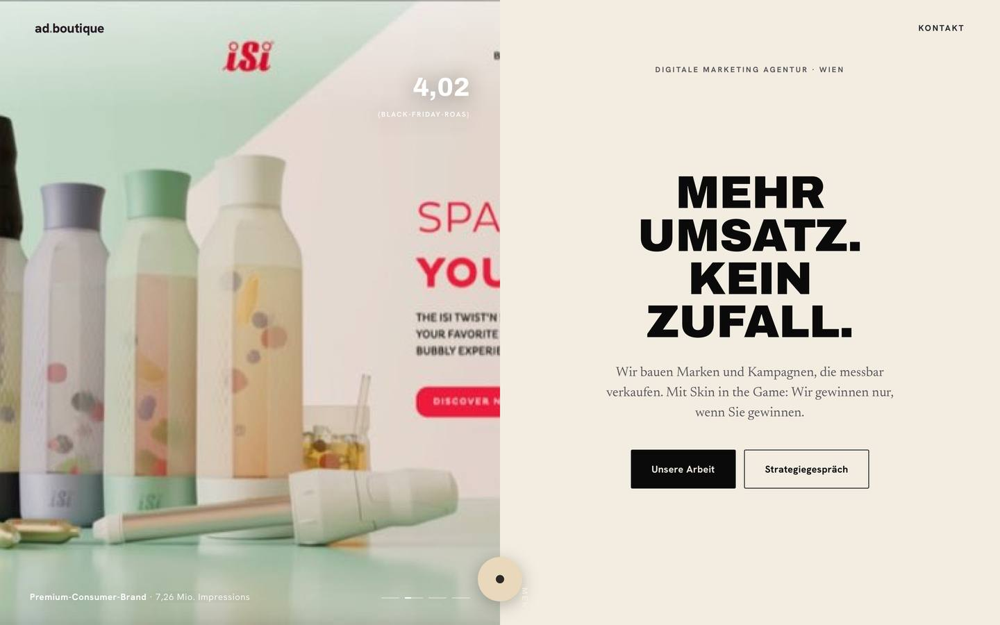 | 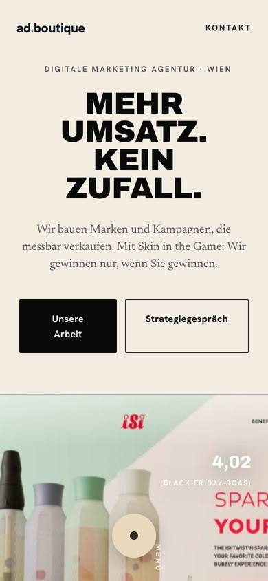 |
| Reckless und Champagner |  | 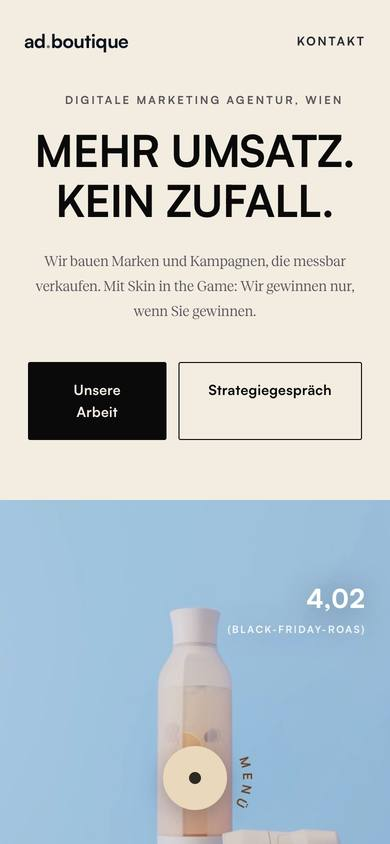 |
| Vorschau v3 (Performance) | 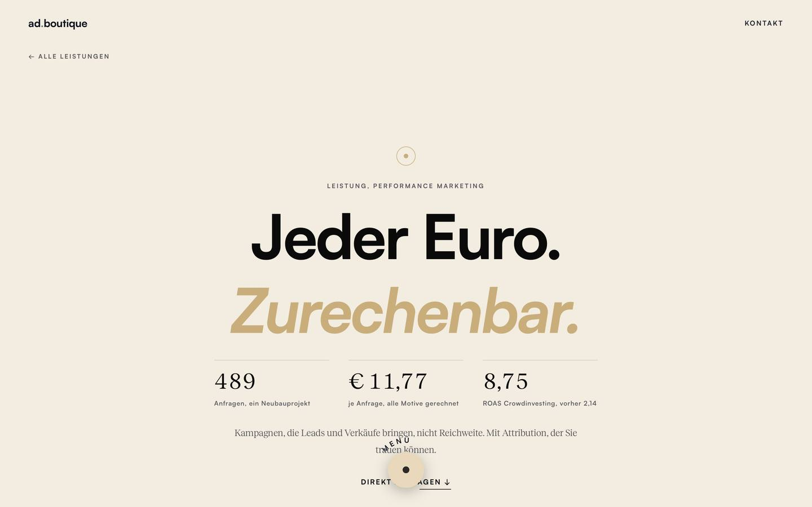 | 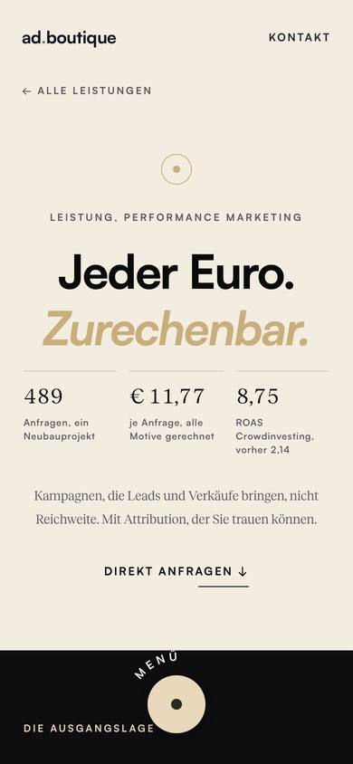 |
| Vor Brand 2026 | 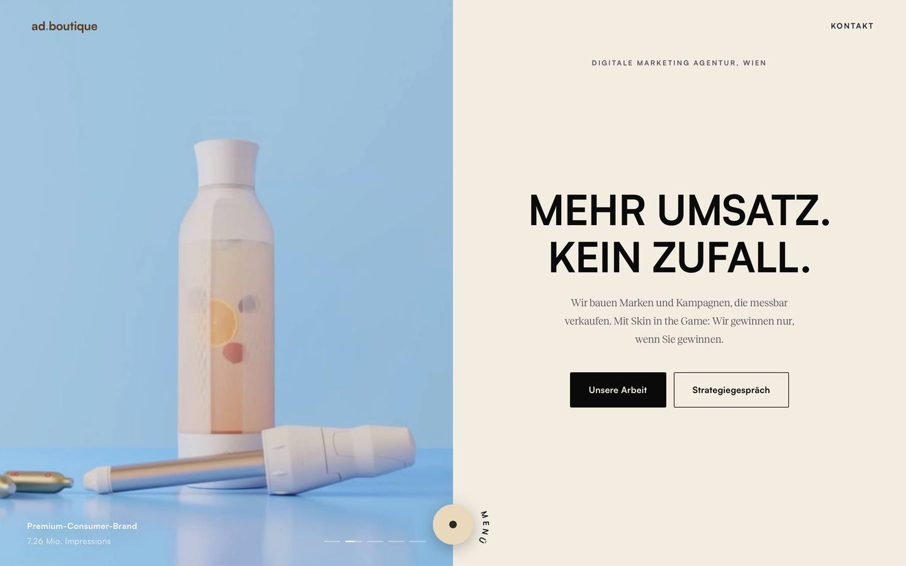 | 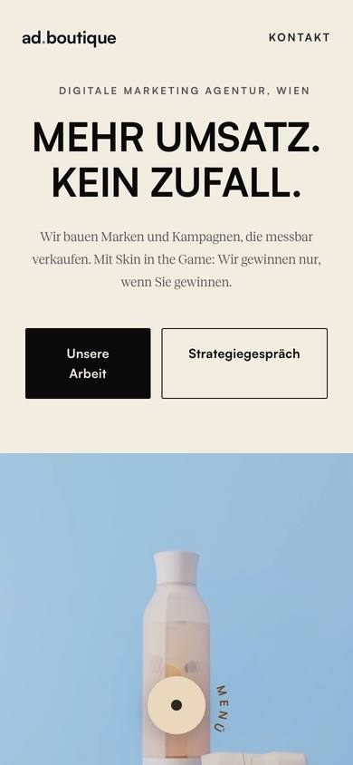 |
| Brand-Test-Theme | 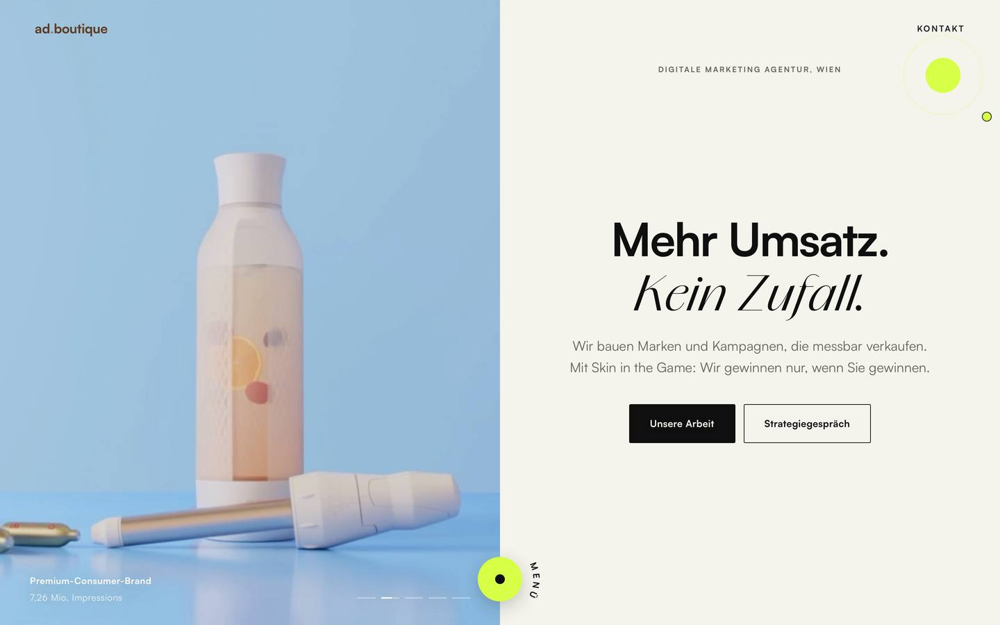 | 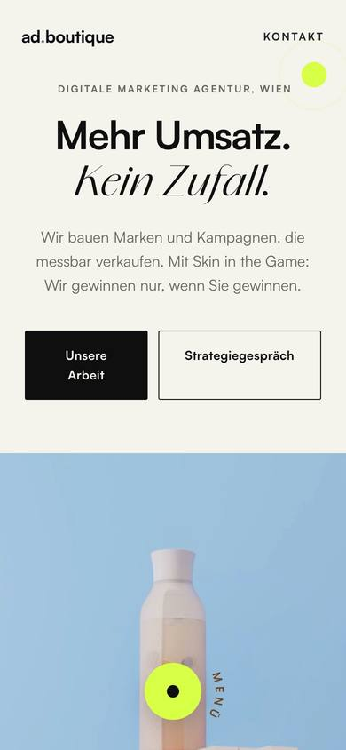 |
| Coach-Kombination |  | 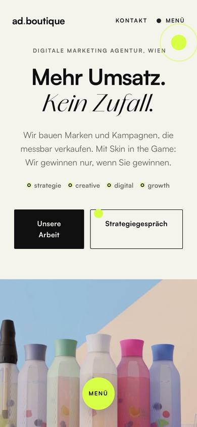 |
| Vor der Brand-Vereinheitlichung | 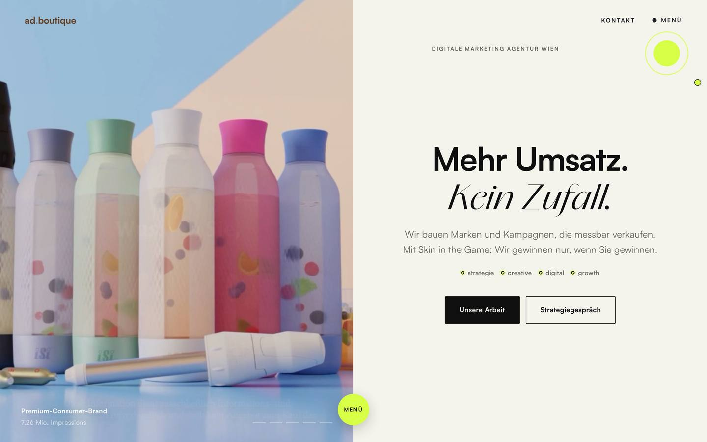 |  |
| Wörterbuch-Hero (Entwurf) | 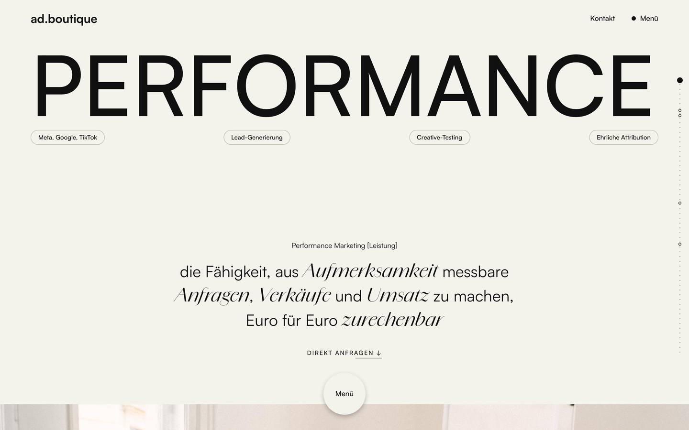 | 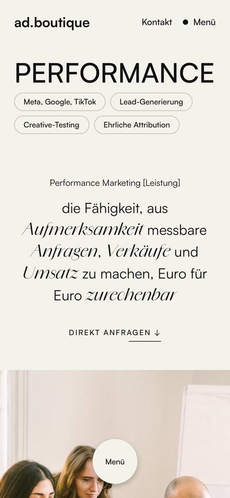 |
| Aktuell | 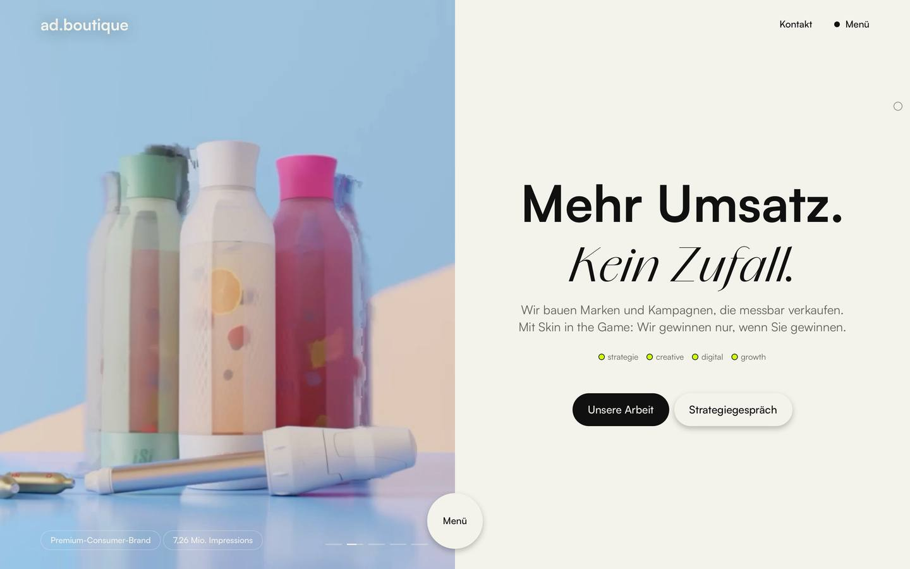 | 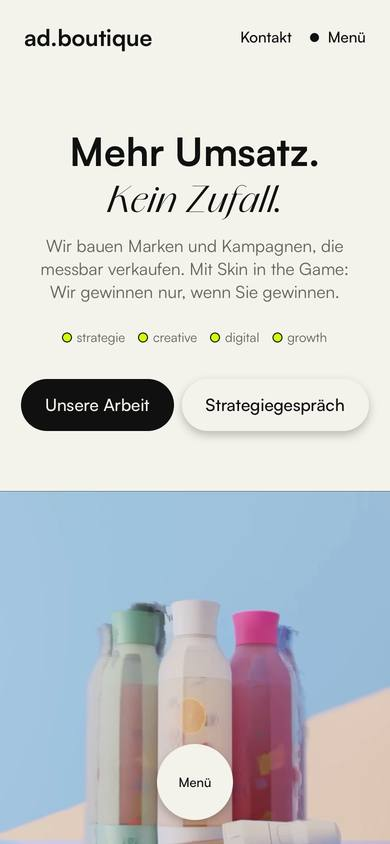 |

## Neue Version eintragen

1. Variante auf eigenem Branch bauen (`daniel/...`, `florian/...`, `claude/...`).
2. Wird sie verworfen: Branch in `archiv/JJJJ-MM-TT-name` umbenennen, Tag setzen, pushen, Zeile oben ergänzen.
3. Screenshots mit `_tools/scrollshot` (Mac) oder Playwright (Cloud) nach `docs/versionen/` legen, Desktop 1440 und Handy 390.
